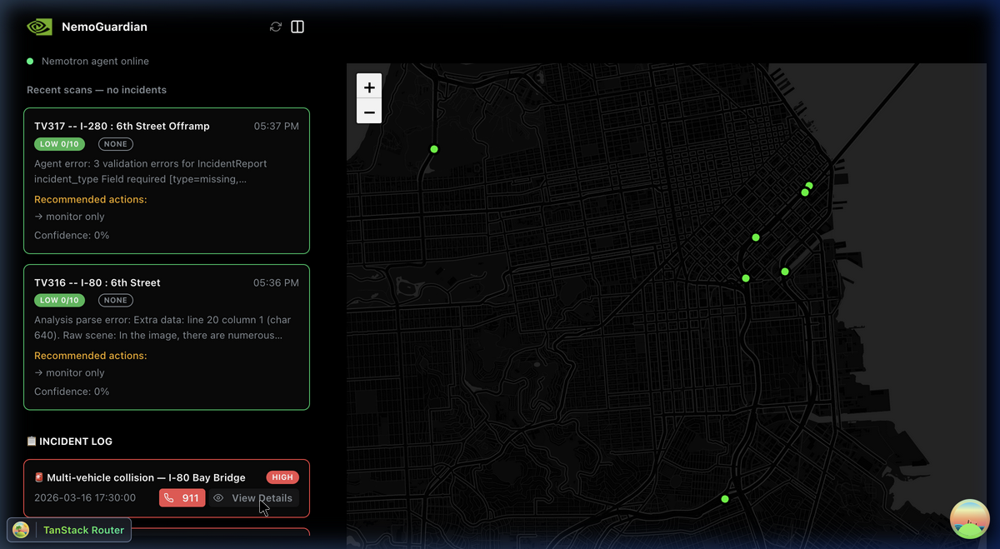
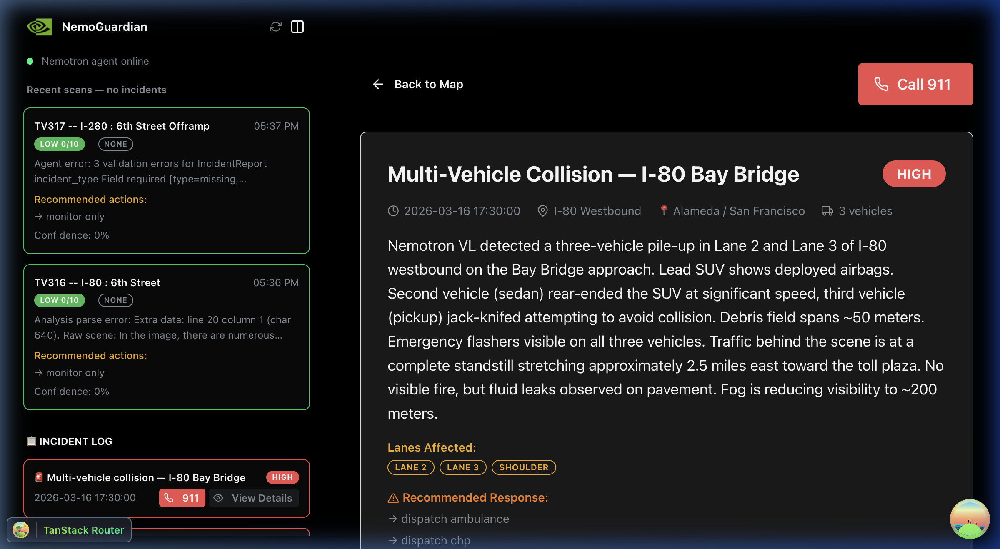
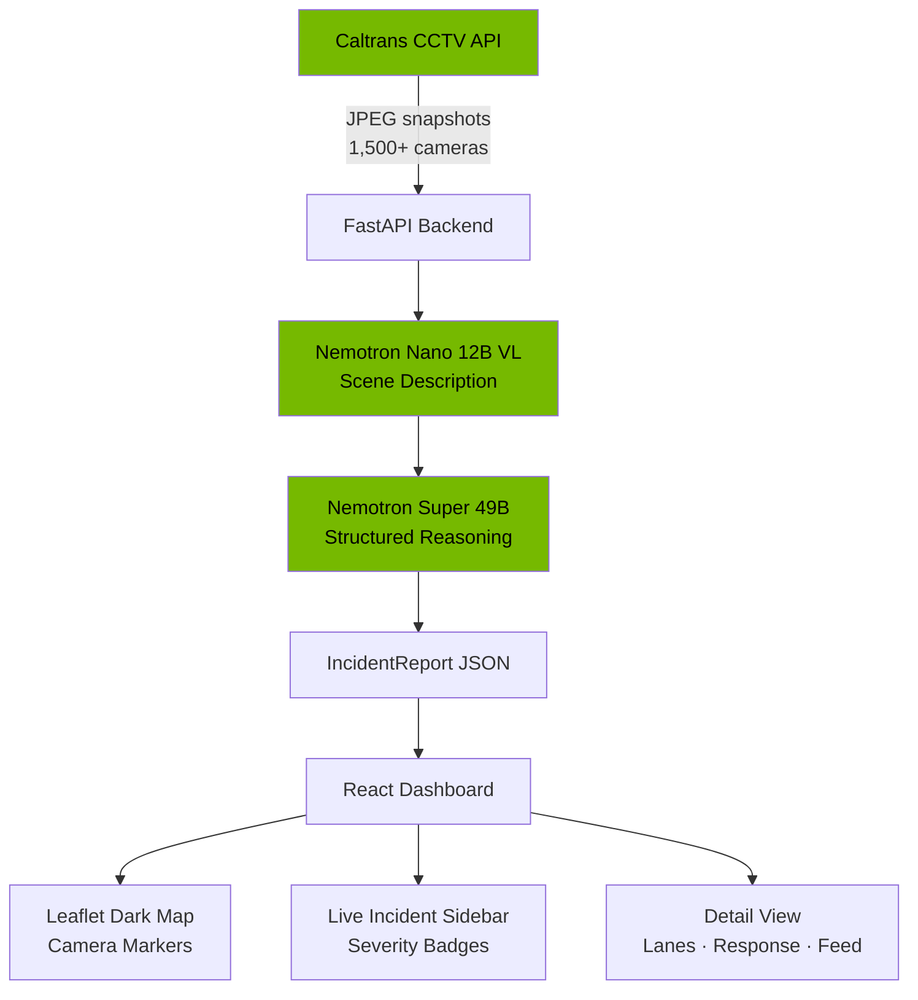

# NemoGuardian

**AI-powered real-time highway incident detection** using California DOT live CCTV feeds and NVIDIA Nemotron models.

NemoGuardian analyzes live camera frames from 1,500+ Caltrans CCTV cameras using a two-step agentic pipeline: **Nemotron VL** describes the scene, then **Nemotron Super 49B** reasons about severity and recommends emergency response — all in seconds.

## Screenshots

### Dashboard — Live Map with Camera Feeds & Incident Log


### Incident Detail — Nemotron VL Analysis Report


## Architecture



## NVIDIA Tech Stack

| Technology | Role |
|---|---|
| **Nemotron Nano 12B VL** | Vision-language scene analysis on CCTV frames |
| **Nemotron Super 49B** | Structured reasoning → incident classification |
| **NVIDIA NIM** | Hosted inference microservices (no GPU needed) |
| **ReAct Pattern** | Observe scene → Reason about severity → Recommend action |

## Quick Start

### Backend

```bash
cd sentinel
pip install -r requirements.txt
export NVIDIA_API_KEY=nvapi-YOUR_KEY   # from build.nvidia.com
python test_pipeline.py                # smoke test
uvicorn server:app --host 0.0.0.0 --port 8000
```

### Frontend

```bash
cd frontend
npm install --legacy-peer-deps
npm run dev   # http://localhost:5173
```

## API Endpoints

| Method | Endpoint | Description |
|---|---|---|
| `GET` | `/health` | System status |
| `GET` | `/cameras?district=7` | List Caltrans cameras |
| `POST` | `/analyze` | Analyze a frame (base64 or URL) |
| `POST` | `/analyze-camera/{id}` | Auto-fetch + analyze a camera |
| `GET` | `/incidents` | Recent incident reports |
| `POST` | `/monitor/start` | Start background polling loop |
| `POST` | `/monitor/stop` | Stop monitoring |

## Project Structure

```
├── sentinel/          # Python backend
│   ├── agent.py       # Nemotron VL + Super 49B pipeline
│   ├── server.py      # FastAPI server with CORS
│   ├── caltrans.py    # Caltrans CCTV feed ingester
│   └── test_pipeline.py
├── frontend/          # React + Vite + Mantine
│   ├── src/api.ts     # Typed API client
│   ├── src/components/Map.tsx
│   ├── src/components/Common/Home/HomeSideBar.tsx
│   └── src/routes/log.$logId.tsx
└── docs/screenshots/
```

## Team

Built at the **NVIDIA Hackathon 2026**.
